# v3

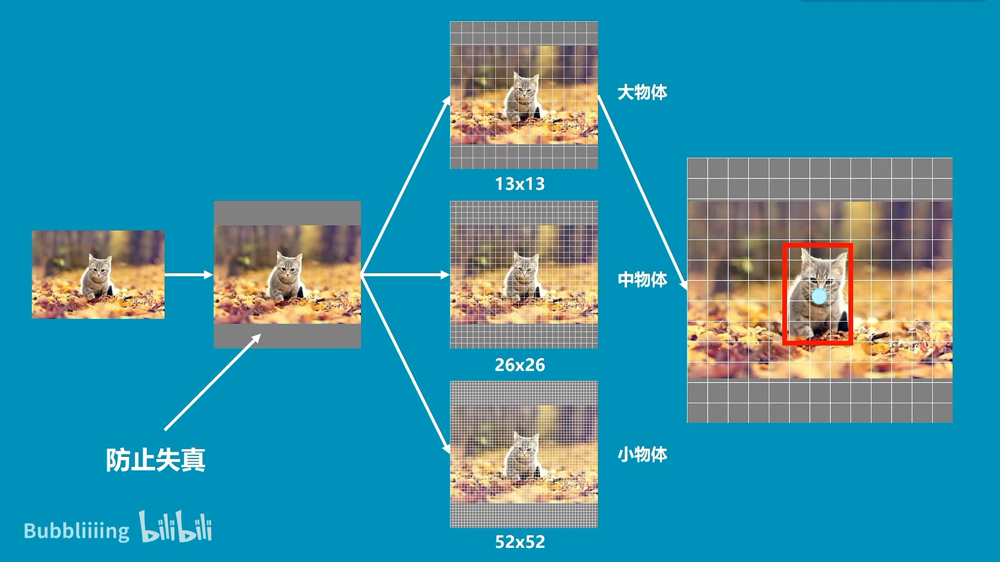

# 什么是YOLOV4

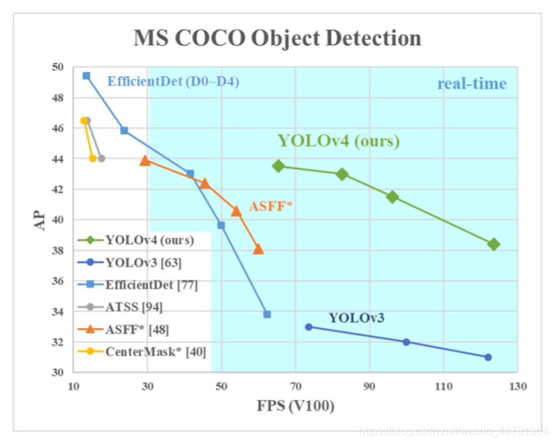


> YOLOV4是YOLOV3的改进版，**在YOLOV3的基础上结合了非常多的小Tricks。**
>
> 尽管没有目标检测上革命性的改变，但是YOLOV4依然很好的结合了速度与精度。
>
> 根据上图也可以看出来，**YOLOV4在YOLOV3的基础上，在FPS不下降的情况下，mAP达到了44，提高非常明显。**
>
> YOLOV4整体上的检测思路和YOLOV3相比相差并不大，都是使用三个特征层进行分类与回归预测。

**请注意！**

**强烈建议在学习YOLOV4之前学习YOLOV3，因为YOLOV4确实可以看作是YOLOV3结合一系列改进的版本！**


# 代码下载

https://github.com/bubbliiiing/yolov4-pytorch
 喜欢的可以给个star噢！


# YOLOV4改进的部分（不完全）

**1、主干特征提取网络：DarkNet53 => CSPDarkNet53**

**2、特征金字塔：SPP，PAN**

**3、分类回归层：YOLOv3（未改变）**

**4、训练用到的小技巧：Mosaic数据增强、Label Smoothing平滑、CIOU、学习率余弦退火衰减**

**5、激活函数：使用Mish激活函数**

**以上并非全部的改进部分，还存在一些其它的改进，由于YOLOV4使用的改进实在太多了，很难完全实现与列出来，这里只列出来了一些我比较感兴趣，而且非常有效的改进。**

> 还有一个重要的事情：
>
> **论文中提到的SAM，作者自己的源码也没有使用。**

**还有其它很多的tricks，不是所有的tricks都有提升，我也没法实现全部的tricks**。

整篇BLOG会结合YOLOV3与YOLOV4的差别进行解析


# YOLOV4结构解析

**为方便理解，本文将所有通道数都放到了最后一维度。**


## 1、主干特征提取网络Backbone

> 当输入是416x416时，特征结构如下：
>
> SPP是三条不同尺寸的最大池化

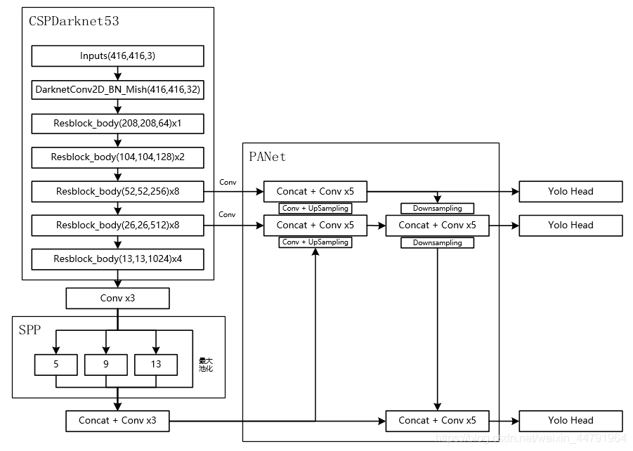

> 当输入是608x608时，特征结构如下：

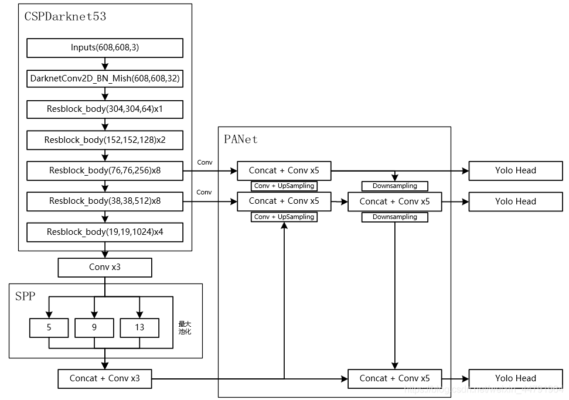

主干特征提取网络Backbone的改进点有两个：

**a).主干特征提取网络：DarkNet53 => CSPDarkNet53**

**b).激活函数：使用Mish激活函数**

如果大家对YOLOV3比较熟悉的话，应该知道Darknet53的结构，其由一系列残差网络结构构成。在Darknet53中，其存在**resblock_body模块**，其由一次**下采样**和**多次残差结构的堆叠**构成，Darknet53便是由**resblock_body模块组合而成**。

而在YOLOV4中，其对该部分进行了一定的修改。

1、其一是**将DarknetConv2D的激活函数由LeakyReLU修改成了Mish**，卷积块由**DarknetConv2D_BN_Leaky变成了DarknetConv2D_BN_Mish**。
 Mish函数的公式与图像如下：


$$
Mish=x * tanh(ln(1+e^x))
$$
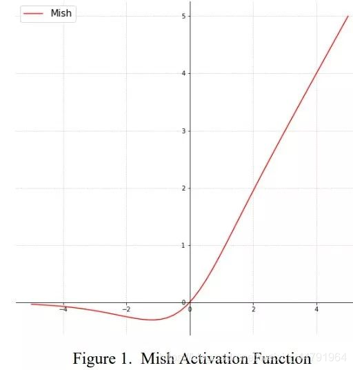

```python
nn.Mish()
F.mish()

#-------------------------------------------------#
#   MISH激活函数, nn.Mish()
#-------------------------------------------------#
class Mish(nn.Module):
    def __init__(self):
        super(Mish, self).__init__()

    def forward(self, x):
        # Mish = x * tanh(ln(1+e^x))
        return x * torch.tanh(F.softplus(x))
```

> SiLU

$$
f(x) = x ⋅ sigmoid(x)
$$


> sigmoid

$$
f(x) = \frac 1 {1+e^{-x}}
$$

2、其二是将resblock_body的结构进行修改，**使用了CSPnet结构。此时YOLOV4当中的Darknet53被修改成了CSPDarknet53**。

> CSP模块优势

- 增强CNN学习能力
- 移除计算瓶颈

- 减少显存使用

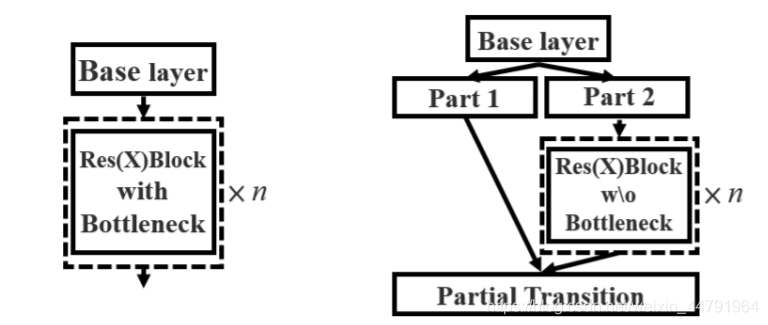

> CSPnet结构并不算复杂，就是**将原来的残差块的堆叠进行了一个拆分，拆成左右两部分:**
>
> **右侧主干部分继续进行原来的残差块的堆叠**；
>
> **左侧部分则像一个残差边一样，经过少量处理直接连接到最后。  1x1Conv**
>
> 因此可以认为**CSP中存在一个大的残差边。**
>
> nets/CSPdarknet.py

```python
#--------------------------------------------------------------------#
#   CSPdarknet的结构块
#
#   CSPnet结构并不算复杂，就是将原来的残差块的堆叠进行了一个拆分，拆成左右两部分:
#   主干部分继续进行原来的残差块的堆叠；
#   另一部分则像一个残差边一样，经过少量处理直接连接到最后。
#   因此可以认为CSP中存在一个大的残差边。
#
#   首先利用ZeroPadding2D和一个步长为2x2的卷积块进行高和宽的压缩
#   然后建立一个大的残差边shortconv、这个大残差边绕过了很多的残差结构
#   主干部分会对num_blocks进行循环，循环内部是残差结构。
#   对于整个CSPdarknet的结构块，就是一个大残差块+内部多个小残差块
#--------------------------------------------------------------------#
class Resblock_body(nn.Module):
    def __init__(self, in_channels, out_channels, num_blocks, first):
        super(Resblock_body, self).__init__()
        #----------------------------------------------------------------#
        #   利用一个步长为2x2的卷积块进行高和宽的压缩
        #----------------------------------------------------------------#
        self.downsample_conv = BasicConv(in_channels, out_channels, 3, stride=2)

        if first:
            #--------------------------------------------------------------------------#
            #   左侧: 然后建立一个大的残差边self.split_conv0、这个大残差边绕过了很多的残差结构 1x1Conv
            #--------------------------------------------------------------------------#
            self.split_conv0 = BasicConv(out_channels, out_channels, 1)

            #----------------------------------------------------------------#
            #   右侧: 主干部分会对num_blocks进行循环，循环内部是残差结构。
            #----------------------------------------------------------------#
            self.split_conv1 = BasicConv(out_channels, out_channels, 1)
            self.blocks_conv = nn.Sequential(
                Resblock(channels=out_channels, hidden_channels=out_channels//2),   # 第一次没有重复Resblock
                BasicConv(out_channels, out_channels, 1)
            )

            #----------------------------------------------------------------#
            #   最后对通道数进行整合
            #----------------------------------------------------------------#
            self.concat_conv = BasicConv(out_channels*2, out_channels, 1)
        else:
            #--------------------------------------------------------------------------#
            #   左侧: 然后建立一个大的残差边self.split_conv0、这个大残差边绕过了很多的残差结构 1x1Conv
            #--------------------------------------------------------------------------#
            self.split_conv0 = BasicConv(out_channels, out_channels//2, 1)

            #----------------------------------------------------------------#
            #   右侧: 干部分会对num_blocks进行循环，循环内部是残差结构。
            #----------------------------------------------------------------#
            self.split_conv1 = BasicConv(out_channels, out_channels//2, 1)
            self.blocks_conv = nn.Sequential(
                *[Resblock(out_channels//2) for _ in range(num_blocks)],    # 重复 num_blocks 次 Resblock
                BasicConv(out_channels//2, out_channels//2, 1)
            )

            #----------------------------------------------------------------#
            #   最后对通道数进行整合
            #----------------------------------------------------------------#
            self.concat_conv = BasicConv(out_channels, out_channels, 1)

    def forward(self, x):
        # 宽高减半
        x = self.downsample_conv(x)
        # 左侧残差
        x0 = self.split_conv0(x)
        # 右侧主干
        x1 = self.split_conv1(x)
        x1 = self.blocks_conv(x1)

        #------------------------------------#
        #   将大残差边再堆叠回来
        #------------------------------------#
        x = torch.cat([x1, x0], dim=1)
        #------------------------------------#
        #   最后对通道数进行整合
        #------------------------------------#
        x = self.concat_conv(x)

        return x
```

> 全部实现代码为：
>
> nets/CSPdarknet.py

```python
"""
CSPDarkNet53 相比于 DarkNet53 升级
LeakyReLU => Mish
"""


import math
from collections import OrderedDict

import torch
import torch.nn as nn
import torch.nn.functional as F


#-------------------------------------------------#
#   MISH激活函数, nn.Mish()
#-------------------------------------------------#
class Mish(nn.Module):
    def __init__(self):
        super(Mish, self).__init__()

    def forward(self, x):
        # Mish = x * tanh(ln(1+e^x))
        return x * torch.tanh(F.softplus(x))

#---------------------------------------------------#
#   卷积块 -> 卷积 + 标准化 + 激活函数
#   Conv2d + BatchNormalization + Mish
#---------------------------------------------------#
class BasicConv(nn.Module):
    def __init__(self, in_channels, out_channels, kernel_size, stride=1):
        super(BasicConv, self).__init__()

        self.conv = nn.Conv2d(in_channels, out_channels, kernel_size, stride, kernel_size//2, bias=False)
        self.bn = nn.BatchNorm2d(out_channels)
        self.activation = Mish()    # LeakyReLU => Mish

    def forward(self, x):
        x = self.conv(x)
        x = self.bn(x)
        x = self.activation(x)
        return x

#---------------------------------------------------#
#   CSPdarknet的结构块的组成部分
#   内部堆叠的残差块,宽高维度不变
#   两层卷积 1x1和3x3
#---------------------------------------------------#
class Resblock(nn.Module):
    def __init__(self, channels, hidden_channels=None):
        super(Resblock, self).__init__()

        if hidden_channels is None:
            hidden_channels = channels

        self.block = nn.Sequential(
            BasicConv(channels, hidden_channels, 1),
            BasicConv(hidden_channels, channels, 3)
        )

    def forward(self, x):
        return x + self.block(x)

#--------------------------------------------------------------------#
#   CSPdarknet的结构块
#
#   CSPnet结构并不算复杂，就是将原来的残差块的堆叠进行了一个拆分，拆成左右两部分:
#   主干部分继续进行原来的残差块的堆叠；
#   另一部分则像一个残差边一样，经过少量处理直接连接到最后。
#   因此可以认为CSP中存在一个大的残差边。
#
#   首先利用ZeroPadding2D和一个步长为2x2的卷积块进行高和宽的压缩
#   然后建立一个大的残差边shortconv、这个大残差边绕过了很多的残差结构
#   主干部分会对num_blocks进行循环，循环内部是残差结构。
#   对于整个CSPdarknet的结构块，就是一个大残差块+内部多个小残差块
#--------------------------------------------------------------------#
class Resblock_body(nn.Module):
    def __init__(self, in_channels, out_channels, num_blocks, first):
        super(Resblock_body, self).__init__()
        #----------------------------------------------------------------#
        #   利用一个步长为2x2的卷积块进行高和宽的压缩
        #----------------------------------------------------------------#
        self.downsample_conv = BasicConv(in_channels, out_channels, 3, stride=2)

        if first:
            #--------------------------------------------------------------------------#
            #   左侧: 然后建立一个大的残差边self.split_conv0、这个大残差边绕过了很多的残差结构 1x1Conv
            #--------------------------------------------------------------------------#
            self.split_conv0 = BasicConv(out_channels, out_channels, 1)

            #----------------------------------------------------------------#
            #   右侧: 主干部分会对num_blocks进行循环，循环内部是残差结构。
            #----------------------------------------------------------------#
            self.split_conv1 = BasicConv(out_channels, out_channels, 1)
            self.blocks_conv = nn.Sequential(
                Resblock(channels=out_channels, hidden_channels=out_channels//2),   # 第一次没有重复Resblock
                BasicConv(out_channels, out_channels, 1)
            )

            #----------------------------------------------------------------#
            #   最后对通道数进行整合
            #----------------------------------------------------------------#
            self.concat_conv = BasicConv(out_channels*2, out_channels, 1)
        else:
            #--------------------------------------------------------------------------#
            #   左侧: 然后建立一个大的残差边self.split_conv0、这个大残差边绕过了很多的残差结构 1x1Conv
            #--------------------------------------------------------------------------#
            self.split_conv0 = BasicConv(out_channels, out_channels//2, 1)

            #----------------------------------------------------------------#
            #   右侧: 干部分会对num_blocks进行循环，循环内部是残差结构。
            #----------------------------------------------------------------#
            self.split_conv1 = BasicConv(out_channels, out_channels//2, 1)
            self.blocks_conv = nn.Sequential(
                *[Resblock(out_channels//2) for _ in range(num_blocks)],    # 重复 num_blocks 次 Resblock
                BasicConv(out_channels//2, out_channels//2, 1)
            )

            #----------------------------------------------------------------#
            #   最后对通道数进行整合
            #----------------------------------------------------------------#
            self.concat_conv = BasicConv(out_channels, out_channels, 1)

    def forward(self, x):
        # 宽高减半
        x = self.downsample_conv(x)
        # 左侧残差
        x0 = self.split_conv0(x)
        # 右侧主干
        x1 = self.split_conv1(x)
        x1 = self.blocks_conv(x1)

        #------------------------------------#
        #   将大残差边再堆叠回来
        #------------------------------------#
        x = torch.cat([x1, x0], dim=1)
        #------------------------------------#
        #   最后对通道数进行整合
        #------------------------------------#
        x = self.concat_conv(x)

        return x

#---------------------------------------------------#
#   CSPdarknet53 的主体部分
#   输入为一张416x416x3的图片
#   输出为三个有效特征层
#---------------------------------------------------#
class CSPDarkNet(nn.Module):
    def __init__(self, layers):
        """
        layers: [1, 2, 8, 8, 4] 每个stage重复Resblock次数
        """
        super(CSPDarkNet, self).__init__()
        self.inplanes = 32
        # 416,416,3 -> 416,416,32
        self.conv1 = BasicConv(3, self.inplanes, kernel_size=3, stride=1)
        # stages的out_channels
        self.feature_channels = [64, 128, 256, 512, 1024]

        self.stages = nn.ModuleList([
            # 416,416,32 -> 208,208,64
            Resblock_body(self.inplanes, self.feature_channels[0], layers[0], first=True),
            # 208,208,64 -> 104,104,128
            Resblock_body(self.feature_channels[0], self.feature_channels[1], layers[1], first=False),
            # 104,104,128 -> 52,52,256
            Resblock_body(self.feature_channels[1], self.feature_channels[2], layers[2], first=False),
            # 52,52,256 -> 26,26,512
            Resblock_body(self.feature_channels[2], self.feature_channels[3], layers[3], first=False),
            # 26,26,512 -> 13,13,1024
            Resblock_body(self.feature_channels[3], self.feature_channels[4], layers[4], first=False)
        ])

        self.num_features = 1
        for m in self.modules():
            if isinstance(m, nn.Conv2d):
                n = m.kernel_size[0] * m.kernel_size[1] * m.out_channels
                m.weight.data.normal_(0, math.sqrt(2. / n))
            elif isinstance(m, nn.BatchNorm2d):
                m.weight.data.fill_(1)
                m.bias.data.zero_()


    def forward(self, x):
        x = self.conv1(x)               # 416,416,3 -> 416,416,32

        x = self.stages[0](x)           # 416,416,32  -> 208,208,64
        x = self.stages[1](x)           # 208,208,64  -> 104,104,128
        out3 = self.stages[2](x)        # 104,104,128 -> 52, 52, 256
        out4 = self.stages[3](out3)     # 52, 52, 256 -> 26, 26, 512
        out5 = self.stages[4](out4)     # 26, 26, 512 -> 13, 13, 1024

        return out3, out4, out5

def darknet53(pretrained, **kwargs):
    model = CSPDarkNet([1, 2, 8, 8, 4])
    if pretrained:
        if isinstance(pretrained, str):
            model.load_state_dict(torch.load(pretrained))
        else:
            raise Exception("darknet request a pretrained path. got [{}]".format(pretrained))
    return model
```

## 2、特征金字塔

> 当输入是416x416时，特征结构如下：
>
> P5经过SPP之后就直接上采样了,不先做5次卷积,最后才做


> 当输入是608x608时，特征结构如下：


> 在特征金字塔部分，YOLOV4结合了两种改进:
>
> **a).使用了SPP结构。(类似PSPNet)**
> **b).使用了PANet结构。**

如上图所示，除去CSPDarknet53和Yolo Head的结构外，都是特征金字塔的结构。

>1、SPP结构参杂在**对CSPdarknet53的最后一个特征层的卷积里**，在**对CSPdarknet53的最后一个特征层进行三次DarknetConv2D_BN_Leaky卷积后，分别利用四个不同尺度的最大池化进行处理**，最大池化的**池化核大小分别为13x13、9x9、5x5、1x1（1x1即无处理）**
>
>stride=1且有padding,所以最终大小不变
>
>nets/yolo.py

```python
#---------------------------------------------------#
#   SPP结构，利用不同大小的池化核进行池化
#   池化后和输入数据进行维度堆叠
#   pool_sizes=[1, 5, 9, 13] 1不变,所以不用做了
#---------------------------------------------------#
class SpatialPyramidPooling(nn.Module):
    def __init__(self, pool_sizes=[5, 9, 13]):
        super().__init__()
        #                                          kernel_size,stride,padding stride=1且有padding,所以最终大小不变
        self.maxpools = nn.ModuleList([nn.MaxPool2d(pool_size, 1, pool_size//2) for pool_size in pool_sizes])

    def forward(self, x):
        features = [maxpool(x) for maxpool in self.maxpools[::-1]]  # ::-1 倒叙
        #                   和源数据一起拼接
        features = torch.cat(features + [x], dim=1)

        return features
```

其可以**它能够极大地增加感受野，分离出最显著的上下文特征**。

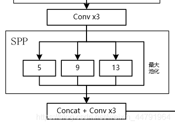


2、PANet是2018的一种实例分割算法，其具体结构由反复提升特征的意思。

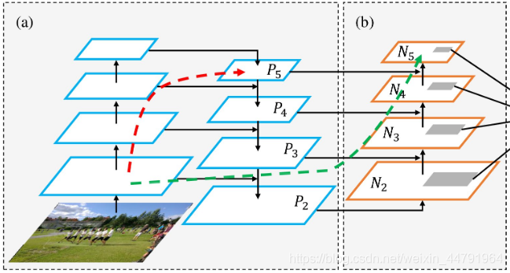

> 上图为原始的PANet的结构，可以看出来其具有**一个非常重要的特点就是特征的反复提取**。
>
> 在（a）里面是传统的特征金字塔结构，在完成特征金字塔从**下到上的特征提取后**，还需要**实现（b）中从上到下的特征提取。**

而在YOLOV4当中，其主要是在**三个有效特征层上使用了PANet结构。**

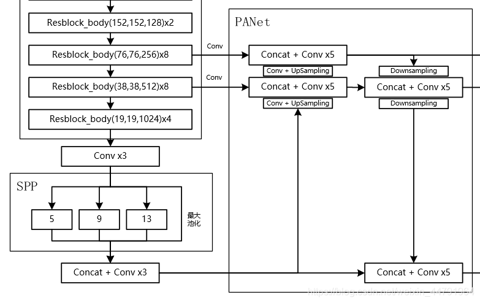

> 实现代码如下：
>
> nets/yolo.py

```python
#---------------------------------------------------#
#   yolo_body
#---------------------------------------------------#
class YoloBody(nn.Module):
    def __init__(self, anchors_mask, num_classes, pretrained = False):
        super().__init__()
        #---------------------------------------------------#
        #   生成CSPdarknet53的主干模型
        #   获得三个有效特征层，他们的shape分别是：
        #   52,52,256
        #   26,26,512
        #   13,13,1024
        #---------------------------------------------------#
        self.backbone   = darknet53(pretrained)

        #---------------------------------------------------#
        #   SPP部分,不同分支池化
        #---------------------------------------------------#
        self.conv1      = make_three_conv([512,1024], 1024)     # 13,13,1024 -> 13,13,512
        self.SPP        = SpatialPyramidPooling()               # 13,13,512 -> 13,13,2048
        self.conv2      = make_three_conv([512,1024], 2048)     # 13,13,2048 -> 13,13,512

        #---------------------------------------------------#
        #   上采样部分 2次
        #---------------------------------------------------#
        self.upsample1          = Upsample(512, 256)    # p5的1x1conv+上采样
        self.conv_for_P4        = conv2d(512, 256, 1)   # 拼接之前的1x1conv
        self.make_five_conv1    = make_five_conv([256, 512], 512)

        self.upsample2          = Upsample(256, 128)    # p4的1x1conv+上采样
        self.conv_for_P3        = conv2d(256, 128, 1)   # 拼接之前的1x1conv
        self.make_five_conv2    = make_five_conv([128, 256], 256)

        #---------------------------------------------------#
        #   head部分
        #   下采样部分 2次 重新计算P4 P5
        #---------------------------------------------------#
        # 3*(5+num_classes) = 3*(5+20) = 3*(4+1+20)=75  3 每个点有3中框, 4代表位置, 1代表有没有物体 20代表分类数
        self.yolo_head3         = yolo_head([256, len(anchors_mask[0]) * (5 + num_classes)],128)

        self.down_sample1       = conv2d(128, 256, 3, stride=2)
        self.make_five_conv3    = make_five_conv([256, 512], 512)

        # 3*(5+num_classes) = 3*(5+20) = 3*(4+1+20)=75
        self.yolo_head2         = yolo_head([512, len(anchors_mask[1]) * (5 + num_classes)],256)

        self.down_sample2       = conv2d(256, 512, 3, stride=2)
        self.make_five_conv4    = make_five_conv([512, 1024], 1024)

        # 3*(5+num_classes)=3*(5+20)=3*(4+1+20)=75
        self.yolo_head1         = yolo_head([1024, len(anchors_mask[2]) * (5 + num_classes)],512)


    def forward(self, x):
        #  backbone
        x2, x1, x0 = self.backbone(x)


        #---------------------------------------------------#
        #   SPP部分,不同分支池化
        #---------------------------------------------------#
        P5 = self.conv1(x0)     # 13,13,1024 -> 13,13,512
        P5 = self.SPP(P5)       # 13,13,512 -> 13,13,2048
        P5 = self.conv2(P5)     # 13,13,2048 -> 13,13,512

        #---------------------------------------------------#
        #   上采样部分 2次
        #---------------------------------------------------#
        P5_upsample = self.upsample1(P5)        # 13,13,512 -> 26,26,256
        P4 = self.conv_for_P4(x1)               # 26,26,512 -> 26,26,256    拼接之前的1x1conv
        P4 = torch.cat([P4, P5_upsample], dim=1)# 26,26,256 + 26,26,256 -> 26,26,512
        P4 = self.make_five_conv1(P4)           # 26,26,512 -> 26,26,256

        P4_upsample = self.upsample2(P4)        # 26,26,256 -> 52,52,128
        P3 = self.conv_for_P3(x2)               # 52,52,256 -> 52,52,128    拼接之前的1x1conv
        P3 = torch.cat([P3, P4_upsample], dim=1)# 52,52,128 + 52,52,128 -> 52,52,256
        P3 = self.make_five_conv2(P3)           # 52,52,256 -> 52,52,128

        #---------------------------------------------------#
        #   下采样部分 2次 重新计算P4 P5
        #---------------------------------------------------#
        P3_downsample = self.down_sample1(P3)       # 52,52,128 -> 26,26,256
        P4 = torch.cat([P3_downsample, P4], dim=1)  # 26,26,256 + 26,26,256 -> 26,26,512
        P4 = self.make_five_conv3(P4)               # 26,26,512 -> 26,26,256

        P4_downsample = self.down_sample2(P4)       # 26,26,256 -> 13,13,512
        P5 = torch.cat([P4_downsample, P5], dim=1)  # 13,13,512 + 13,13,512 -> 13,13,1024
        P5 = self.make_five_conv4(P5)               # 13,13,1024 -> 13,13,512

        #---------------------------------------------------#
        #   第三个特征层
        #   y3=(batch_size,75,52,52)
        #---------------------------------------------------#
        out2 = self.yolo_head3(P3)
        #---------------------------------------------------#
        #   第二个特征层
        #   y2=(batch_size,75,26,26)
        #---------------------------------------------------#
        out1 = self.yolo_head2(P4)
        #---------------------------------------------------#
        #   第一个特征层
        #   y1=(batch_size,75,13,13)
        #---------------------------------------------------#
        out0 = self.yolo_head1(P5)

        return out0, out1, out2
```

## 3、YoloHead利用获得到的特征进行预测

> 当输入是416x416时，特征结构如下：


> 当输入是608x608时，特征结构如下：


1、在特征利用部分，YoloV4提取**多特征层进行目标检测**，一共**提取三个特征层**，分别位于中间层，中下层，底层，三个特征层的shape分别为(76,76,256)、(38,38,512)、(19,19,1024)。

2、输出层的shape分别为(**19,19,75**)，(**38,38,75**)，(**76,76,75**)，**最后一个维度为75是因为该图是基于voc数据集的，它的类为20种，YoloV4只有针对每一个特征层存在3个先验框，所以最后维度为3x25；**

**如果使用的是coco训练集，类则为80种，最后的维度应该为255 = 3x85**，三个特征层的shape为(**19,19,255**)，(**38,38,255**)，(**76,76,255**)

> 实现代码如下：
>
> nets/yolo.py

```python
"""
LeakyReLU
"""

from collections import OrderedDict

import torch
import torch.nn as nn

from nets.CSPdarknet import darknet53

# conv+bn+relu
def conv2d(filter_in, filter_out, kernel_size, stride=1):
    pad = (kernel_size - 1) // 2 if kernel_size else 0
    return nn.Sequential(OrderedDict([
        ("conv", nn.Conv2d(filter_in, filter_out, kernel_size=kernel_size, stride=stride, padding=pad, bias=False)),
        ("bn", nn.BatchNorm2d(filter_out)),
        ("relu", nn.LeakyReLU(0.1)),
    ]))

#---------------------------------------------------#
#   SPP结构，利用不同大小的池化核进行池化,增大感受野
#   池化后和输入数据进行维度堆叠
#   pool_sizes=[1, 5, 9, 13] 1不变,所以不用做了
#---------------------------------------------------#
class SpatialPyramidPooling(nn.Module):
    def __init__(self, pool_sizes=[5, 9, 13]):
        super().__init__()
        #                                                       stride=1且有padding,所以最终大小不变
        self.maxpools = nn.ModuleList([nn.MaxPool2d(pool_size, stride=1, padding=pool_size//2) for pool_size in pool_sizes])

    def forward(self, x):
        features = [maxpool(x) for maxpool in self.maxpools[::-1]]  # ::-1 倒叙
        # maxpool时kernel=1不用做,所以要加上[x]
        features = torch.cat(features + [x], dim=1)

        return features

#---------------------------------------------------#
#   1x1卷积 + 上采样
#---------------------------------------------------#
class Upsample(nn.Module):
    def __init__(self, in_channels, out_channels):
        super().__init__()

        self.upsample = nn.Sequential(
            conv2d(in_channels, out_channels, 1),
            nn.Upsample(scale_factor=2, mode='nearest')
        )

    def forward(self, x,):
        x = self.upsample(x)
        return x

#---------------------------------------------------#
#   三次卷积块 SPP前后的模块
#---------------------------------------------------#
def make_three_conv(filters_list, in_filters):
    m = nn.Sequential(
        conv2d(in_filters,      filters_list[0], 1),    # 1 降低通道
        conv2d(filters_list[0], filters_list[1], 3),    # 3 提取特征
        conv2d(filters_list[1], filters_list[0], 1),
    )
    return m

#---------------------------------------------------#
#   五次卷积块 PANet中使用
#---------------------------------------------------#
def make_five_conv(filters_list, in_filters):
    m = nn.Sequential(
        conv2d(in_filters,      filters_list[0], 1),
        conv2d(filters_list[0], filters_list[1], 3),
        conv2d(filters_list[1], filters_list[0], 1),
        conv2d(filters_list[0], filters_list[1], 3),
        conv2d(filters_list[1], filters_list[0], 1),
    )
    return m

#---------------------------------------------------#
#   最后获得yolov4的输出
#---------------------------------------------------#
def yolo_head(filters_list, in_filters):
    m = nn.Sequential(
        conv2d(in_filters,         filters_list[0], 3),     # 特征整合
        nn.Conv2d(filters_list[0], filters_list[1], 1),     # 将通道转换为预测
    )
    return m

#---------------------------------------------------#
#   yolo_body
#---------------------------------------------------#
class YoloBody(nn.Module):
    def __init__(self, anchors_mask, num_classes, pretrained = False):
        super().__init__()
        #---------------------------------------------------#
        #   生成CSPdarknet53的主干模型
        #   获得三个有效特征层，他们的shape分别是：
        #   52,52,256
        #   26,26,512
        #   13,13,1024
        #---------------------------------------------------#
        self.backbone   = darknet53(pretrained)

        #---------------------------------------------------#
        #   SPP部分,不同分支池化
        #---------------------------------------------------#
        self.conv1      = make_three_conv([512,1024], 1024)     # 13,13,1024 -> 13,13,512
        self.SPP        = SpatialPyramidPooling()               # 13,13,512 -> 13,13,2048
        self.conv2      = make_three_conv([512,1024], 2048)     # 13,13,2048 -> 13,13,512

        #---------------------------------------------------#
        #   上采样部分 2次                  p3,p4要先进行1x1卷积降低维度
        #---------------------------------------------------#
        self.upsample1          = Upsample(512, 256)    # p5的1x1conv+上采样
        self.conv_for_P4        = conv2d(512, 256, 1)   # 拼接之前的1x1conv
        self.make_five_conv1    = make_five_conv([256, 512], 512)

        self.upsample2          = Upsample(256, 128)    # p4的1x1conv+上采样
        self.conv_for_P3        = conv2d(256, 128, 1)   # 拼接之前的1x1conv
        self.make_five_conv2    = make_five_conv([128, 256], 256)

        #---------------------------------------------------#
        #   head部分
        #   下采样部分 2次 重新计算P4 P5    输入数据不需要预先进行1x1卷积
        #---------------------------------------------------#
        # 3*(5+num_classes) = 3*(5+20) = 3*(4+1+20)=75  3 每个点有3中框, 4代表位置, 1代表有没有物体 20代表分类数
        self.yolo_head3         = yolo_head([256, len(anchors_mask[0]) * (5 + num_classes)],128)

        self.down_sample1       = conv2d(128, 256, 3, stride=2)
        self.make_five_conv3    = make_five_conv([256, 512], 512)

        # 3*(5+num_classes) = 3*(5+20) = 3*(4+1+20)=75
        self.yolo_head2         = yolo_head([512, len(anchors_mask[1]) * (5 + num_classes)],256)

        self.down_sample2       = conv2d(256, 512, 3, stride=2)
        self.make_five_conv4    = make_five_conv([512, 1024], 1024)

        # 3*(5+num_classes)=3*(5+20)=3*(4+1+20)=75
        self.yolo_head1         = yolo_head([1024, len(anchors_mask[2]) * (5 + num_classes)],512)


    def forward(self, x):
        #  backbone
        out3, out4, out5 = self.backbone(x)

        #---------------------------------------------------#
        #   SPP部分,不同分支池化
        #---------------------------------------------------#
        P5 = self.conv1(out5)   # 13,13,1024 -> 13,13,512
        P5 = self.SPP(P5)       # 13,13,512 -> 13,13,2048
        P5 = self.conv2(P5)     # 13,13,2048 -> 13,13,512

        #---------------------------------------------------#
        #   上采样部分 2次
        #---------------------------------------------------#
        P5_upsample = self.upsample1(P5)        # 13,13,512 -> 26,26,256
        P4 = self.conv_for_P4(out4)             # 26,26,512 -> 26,26,256    拼接之前的1x1conv
        P4 = torch.cat([P4, P5_upsample], dim=1)# 26,26,256 + 26,26,256 -> 26,26,512
        P4 = self.make_five_conv1(P4)           # 26,26,512 -> 26,26,256

        P4_upsample = self.upsample2(P4)        # 26,26,256 -> 52,52,128
        P3 = self.conv_for_P3(out3)             # 52,52,256 -> 52,52,128    拼接之前的1x1conv
        P3 = torch.cat([P3, P4_upsample], dim=1)# 52,52,128 + 52,52,128 -> 52,52,256
        P3 = self.make_five_conv2(P3)           # 52,52,256 -> 52,52,128

        #---------------------------------------------------#
        #   下采样部分 2次 重新计算P4 P5
        #---------------------------------------------------#
        P3_downsample = self.down_sample1(P3)       # 52,52,128 -> 26,26,256
        P4 = torch.cat([P3_downsample, P4], dim=1)  # 26,26,256 + 26,26,256 -> 26,26,512
        P4 = self.make_five_conv3(P4)               # 26,26,512 -> 26,26,256

        P4_downsample = self.down_sample2(P4)       # 26,26,256 -> 13,13,512
        P5 = torch.cat([P4_downsample, P5], dim=1)  # 13,13,512 + 13,13,512 -> 13,13,1024
        P5 = self.make_five_conv4(P5)               # 13,13,1024 -> 13,13,512

        #---------------------------------------------------#
        #   第三个特征层
        #   y3=(batch_size,75,52,52)
        #---------------------------------------------------#
        out2 = self.yolo_head3(P3)
        #---------------------------------------------------#
        #   第二个特征层
        #   y2=(batch_size,75,26,26)
        #---------------------------------------------------#
        out1 = self.yolo_head2(P4)
        #---------------------------------------------------#
        #   第一个特征层
        #   y1=(batch_size,75,13,13)
        #---------------------------------------------------#
        out0 = self.yolo_head1(P5)

        return out0, out1, out2
```

## 4、预测结果的解码

由第二步我们可以获得三个特征层的预测结果，shape分别为(**N,19,19,255**)，(**N,38,38,255**)，(**N,76,76,255**)的数据，对应每个图分为19x19、38x38、76x76的网格上3个预测框的位置。

但是这个预测结果并不对应着最终的预测框在图片上的位置，还需要解码才可以完成。

此处要讲一下yolo3的预测原理，yolo3的3个特征层分别将整幅图分为19x19、38x38、76x76的网格，每个网络点负责一个区域的检测。

我们知道特征层的预测结果对应着三个预测框的位置，我们先将其reshape一下，其结果为(**N,19,19,3,85**)，(**N,38,38,3,85**)，(**N,76,76,3,85**)。

最后一个维度中的85包含了4+1+80，**分别代表x_offset、y_offset、h和w、置信度、分类结果。**

yolo3的解码过程就是**将每个网格点加上它对应的x_offset和y_offset**，加完后的结果就是**预测框的中心**，然后**再利用 先验框和h、w结合 计算出预测框的长和宽**。这样就能得到整个预测框的位置了。

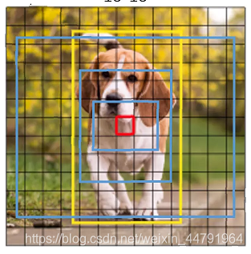

当然得到最终的预测结构后还要进行得分排序与非极大抑制筛选

这一部分基本上是所有目标检测通用的部分。不过该项目的处理方式与其它项目不同。其对于每一个类进行判别。

**1、取出每一类得分大于self.obj_threshold的框和得分。**
**2、利用框的位置和得分进行非极大抑制。**

> 实现代码如下，当调用yolo_eval时，就会对每个特征层进行解码：
>
> utils/utils_bbox.py

```python
import torch
import torch.nn as nn
from torchvision.ops import nms
import numpy as np

"""
对yolo的结果进行解码
"""
class DecodeBox():
    def __init__(self, anchors, num_classes, input_shape, anchors_mask = [[6,7,8], [3,4,5], [0,1,2]]):
        super().__init__()
        self.anchors        = anchors           # 先验框
        self.num_classes    = num_classes
        self.bbox_attrs     = 5 + num_classes
        self.input_shape    = input_shape       # 原始图像大小
        #-----------------------------------------------------------#
        #   13x13的特征层对应的anchor是[142, 110],[192, 243],[459, 401]
        #   26x26的特征层对应的anchor是[36, 75],[76, 55],[72, 146]
        #   52x52的特征层对应的anchor是[12, 16],[19, 36],[40, 28]
        #-----------------------------------------------------------#
        self.anchors_mask   = anchors_mask

    def decode_box(self, inputs):
        """
        inputs: out0, out1, out2
                13    26    52
        """
        outputs = []
        for i, input in enumerate(inputs):
            #-----------------------------------------------#
            #   输入的input一共有三个，他们的shape分别是
            #   b, 75, 13, 13
            #   b, 75, 26, 26
            #   b, 75, 52, 52
            #-----------------------------------------------#
            # 卷积后图片数,高宽
            batch_size      = input.size(0)
            input_height    = input.size(2)
            input_width     = input.size(3)

            #-----------------------------------------------#
            #   调整步长,一次找多少像素,每个特征点对应原图多少个像素
            #   输入为416x416时
            #   stride_h = stride_w = 32、16、8
            #-----------------------------------------------#
            stride_h = self.input_shape[0] / input_height
            stride_w = self.input_shape[1] / input_width
            #-------------------------------------------------#
            #   调整anchor的宽高到相对于特征层的大小(除以步长即可)
            #   此时获得的scaled_anchors大小是相对于特征层的
            #-------------------------------------------------#
            scaled_anchors = [(anchor_width / stride_w, anchor_height / stride_h) for anchor_width, anchor_height in self.anchors[self.anchors_mask[i]]]

            #-----------------------------------------------#
            #   reshape: b, 75, 13, 13 => b, 3, 25, 13, 13
            #   输入的input一共有三个，他们的shape分别是
            #   b, 3, 25, 13, 13
            #   b, 3, 25, 26, 26
            #   b, 3, 25, 52, 52
            #   再将框(2维)的内容变换到最后维度
            #   b, 3, 13, 13, 25  25=4+1+20 4代表x_offset, y_offset, h, w 1代表置信度
            #-----------------------------------------------#
            prediction = input.view(batch_size, len(self.anchors_mask[i]), self.bbox_attrs, input_height, input_width).permute(0, 1, 3, 4, 2).contiguous()

            #-----------------------------------------------#
            #   先验框的中心位置的调整参数
            #   sigmoid固定到0~1之间,每个框的中心点是按照分隔后的最近的左上角点,就是物体位置由网格左上角来负责预测
            #   调整到0~1之间就是坐标点的移动位置在右下角的方框内
            #-----------------------------------------------#
            x = torch.sigmoid(prediction[..., 0])
            y = torch.sigmoid(prediction[..., 1])
            #-----------------------------------------------#
            #   先验框的宽高调整参数
            #-----------------------------------------------#
            w = prediction[..., 2]
            h = prediction[..., 3]
            #-----------------------------------------------#
            #   获得置信度，是否有物体
            #-----------------------------------------------#
            conf        = torch.sigmoid(prediction[..., 4])
            #-----------------------------------------------#
            #   种类置信度
            #   0~1之间,表示可能性
            #-----------------------------------------------#
            pred_cls    = torch.sigmoid(prediction[..., 5:])

            FloatTensor = torch.cuda.FloatTensor if x.is_cuda else torch.FloatTensor
            LongTensor  = torch.cuda.LongTensor if x.is_cuda else torch.LongTensor

            """
            下面要生成默认的先验框,然后使用预测结果进行位置调整
            """
            #----------------------------------------------------------#
            #   生成先验框网格，先验框中心，网格左上角
            #   b,3,13,13 代表13x13的网格上每个网格都有3个先验框
            #----------------------------------------------------------#
            grid_x = torch.linspace(0, input_width - 1, input_width).repeat(input_height, 1).repeat(
                batch_size * len(self.anchors_mask[i]), 1, 1).view(x.shape).type(FloatTensor)
            grid_y = torch.linspace(0, input_height - 1, input_height).repeat(input_width, 1).t().repeat(
                batch_size * len(self.anchors_mask[i]), 1, 1).view(y.shape).type(FloatTensor)

            #----------------------------------------------------------#
            #   按照先验框网格格式生成先验框的宽高
            #   b,3,13,13
            #----------------------------------------------------------#
            anchor_w = FloatTensor(scaled_anchors).index_select(1, LongTensor([0]))
            anchor_h = FloatTensor(scaled_anchors).index_select(1, LongTensor([1]))
            anchor_w = anchor_w.repeat(batch_size, 1).repeat(1, 1, input_height * input_width).view(w.shape)
            anchor_h = anchor_h.repeat(batch_size, 1).repeat(1, 1, input_height * input_width).view(h.shape)

            """
            利用预测值对默认先验框进行调整
            """
            #----------------------------------------------------------#
            #   利用预测结果对先验框进行调整
            #   首先调整先验框的中心，从先验框中心向右下角偏移
            #   再调整先验框的宽高。
            #----------------------------------------------------------#
            pred_boxes          = FloatTensor(prediction[..., :4].shape)
            pred_boxes[..., 0]  = x.data + grid_x   # x,y是预测中心, grid_x,grid_y是默认框的位置,相加就能获取位置,将左上角向右下移动
            pred_boxes[..., 1]  = y.data + grid_y
            pred_boxes[..., 2]  = torch.exp(w.data) * anchor_w  # w,h是预测宽高,anchor_w,anchor_h是默认框的宽高
            pred_boxes[..., 3]  = torch.exp(h.data) * anchor_h  # 指数乘以原值

            #----------------------------------------------------------#
            #   将输出结果归一化成小数的形式
            #----------------------------------------------------------#
            _scale = torch.Tensor([input_width, input_height, input_width, input_height]).type(FloatTensor)
            output = torch.cat((pred_boxes.view(batch_size, -1, 4) / _scale,
                                conf.view(batch_size, -1, 1), pred_cls.view(batch_size, -1, self.num_classes)), -1)
            outputs.append(output.data)
        return outputs

    """
    去除图片灰条
    """
    def yolo_correct_boxes(self, box_xy, box_wh, input_shape, image_shape, letterbox_image):
        #-----------------------------------------------------------------#
        #   把y轴放前面是因为方便预测框和图像的宽高进行相乘
        #-----------------------------------------------------------------#
        box_yx = box_xy[..., ::-1]
        box_hw = box_wh[..., ::-1]
        input_shape = np.array(input_shape)
        image_shape = np.array(image_shape)

        if letterbox_image:
            #-----------------------------------------------------------------#
            #   这里求出来的offset是图像有效区域相对于图像左上角的偏移情况
            #   new_shape指的是宽高缩放情况
            #-----------------------------------------------------------------#
            new_shape = np.round(image_shape * np.min(input_shape/image_shape))
            offset  = (input_shape - new_shape)/2./input_shape
            scale   = input_shape/new_shape

            box_yx  = (box_yx - offset) * scale
            box_hw *= scale

        box_mins    = box_yx - (box_hw / 2.)
        box_maxes   = box_yx + (box_hw / 2.)
        boxes  = np.concatenate([box_mins[..., 0:1], box_mins[..., 1:2], box_maxes[..., 0:1], box_maxes[..., 1:2]], axis=-1)
        boxes *= np.concatenate([image_shape, image_shape], axis=-1)
        return boxes

    """
    非极大抑制,筛选出一定区域内属于同一种类得分最大的框
    """
    def non_max_suppression(self, prediction, num_classes, input_shape, image_shape, letterbox_image, conf_thres=0.5, nms_thres=0.4):
        #----------------------------------------------------------#
        #   将预测结果的格式转换成左上角右下角的格式。
        #   prediction: [batch_size, num_anchors, 25]
        #----------------------------------------------------------#
        box_corner          = prediction.new(prediction.shape)
        box_corner[:, :, 0] = prediction[:, :, 0] - prediction[:, :, 2] / 2     # x1
        box_corner[:, :, 1] = prediction[:, :, 1] - prediction[:, :, 3] / 2     # y1
        box_corner[:, :, 2] = prediction[:, :, 0] + prediction[:, :, 2] / 2     # x2
        box_corner[:, :, 3] = prediction[:, :, 1] + prediction[:, :, 3] / 2     # y2
        prediction[:, :, :4] = box_corner[:, :, :4]                             # 替换前4个数据换成左上角右下角的格式

        output = [None for _ in range(len(prediction))]

        #----------------------------------------------------------#
        #   循环图片,一张图片一次
        #----------------------------------------------------------#
        for i, image_pred in enumerate(prediction):
            #----------------------------------------------------------#
            #   image_pred[:, 5:5 + num_classes] 取出分类信息
            #   对种类预测部分取max。
            #   class_conf  [num_anchors, 1]    种类置信度
            #   class_pred  [num_anchors, 1]    种类
            #----------------------------------------------------------#
            class_conf, class_pred = torch.max(image_pred[:, 5:5 + num_classes], 1, keepdim=True)

            #----------------------------------------------------------#
            #   利用置信度进行第一轮筛选,返回0/1
            #   image_pred[:, 4] * class_conf[:, 0]  是否包含物体 * 置信度 得到最后的置信度
            #----------------------------------------------------------#
            conf_mask = (image_pred[:, 4] * class_conf[:, 0] >= conf_thres).squeeze()

            #----------------------------------------------------------#
            #   根据置信度进行预测结果的筛选,使用0/1筛选
            #----------------------------------------------------------#
            image_pred = image_pred[conf_mask]  # 网络预测结果
            class_conf = class_conf[conf_mask]  # 种类置信度
            class_pred = class_pred[conf_mask]  # 种类
            if not image_pred.size(0):
                continue

            #-------------------------------------------------------------------------#
            #   堆叠位置参数,是否有物体,种类置信度,种类
            #   detections  [num_anchors, 7]
            #   7的内容为：x1, y1, x2, y2, obj_conf(是否包含物体置信度), class_conf(种类置信度), class_pred(种类预测值)
            #-------------------------------------------------------------------------#
            detections = torch.cat((image_pred[:, :5], class_conf.float(), class_pred.float()), 1)

            #------------------------------------------#
            #   获得预测结果中包含的所有种类
            #------------------------------------------#
            unique_labels = detections[:, -1].cpu().unique()    # 种类.unique减少后面的循环

            if prediction.is_cuda:
                unique_labels = unique_labels.cuda()
                detections = detections.cuda()

            for c in unique_labels:
                #------------------------------------------#
                #   获得某一类得分筛选后全部的预测结果
                #------------------------------------------#
                detections_class = detections[detections[:, -1] == c]

                #------------------------------------------#
                #   使用官方自带的非极大抑制会速度更快一些！
                #------------------------------------------#
                keep = nms(
                    detections_class[:, :4],                            # 坐标,中心+宽高
                    detections_class[:, 4] * detections_class[:, 5],    # 得分 4代表是否有物体,5代表置信度
                    nms_thres
                )
                max_detections = detections_class[keep]

                # # 按照存在物体的置信度排序
                # _, conf_sort_index = torch.sort(detections_class[:, 4]*detections_class[:, 5], descending=True)
                # detections_class = detections_class[conf_sort_index]
                # # 进行非极大抑制
                # max_detections = []
                # while detections_class.size(0):
                #     # 取出这一类置信度最高的，一步一步往下判断，判断重合程度是否大于nms_thres，如果是则去除掉
                #     max_detections.append(detections_class[0].unsqueeze(0))
                #     if len(detections_class) == 1:
                #         break
                #     ious = bbox_iou(max_detections[-1], detections_class[1:])
                #     detections_class = detections_class[1:][ious < nms_thres]
                # # 堆叠
                # max_detections = torch.cat(max_detections).data

                # Add max detections to outputs
                output[i] = max_detections if output[i] is None else torch.cat((output[i], max_detections))

            # 去除图片灰条
            if output[i] is not None:
                output[i]           = output[i].cpu().numpy()
                box_xy, box_wh      = (output[i][:, 0:2] + output[i][:, 2:4])/2, output[i][:, 2:4] - output[i][:, 0:2]
                output[i][:, :4]    = self.yolo_correct_boxes(box_xy, box_wh, input_shape, image_shape, letterbox_image)
        return output

```

## 5、在原图上进行绘制

通过第四步，我们可以获得预测框在原图上的位置，而且这些预测框都是经过筛选的。这些筛选后的框可以直接绘制在图片上，就可以获得结果了。

# YOLOV4的训练

## 1、YOLOV4的改进训练技巧

### a)、Mosaic数据增强

> Yolov4的mosaic数据增强参考了CutMix数据增强方式，理论上具有一定的相似性！
>

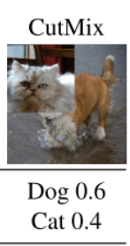


 但是mosaic利用了四张图片，**根据论文所说其拥有一个巨大的优点是丰富检测物体的背景！且在BN计算的时候一下子会计算四张图片的数据！**
 就像下图这样：

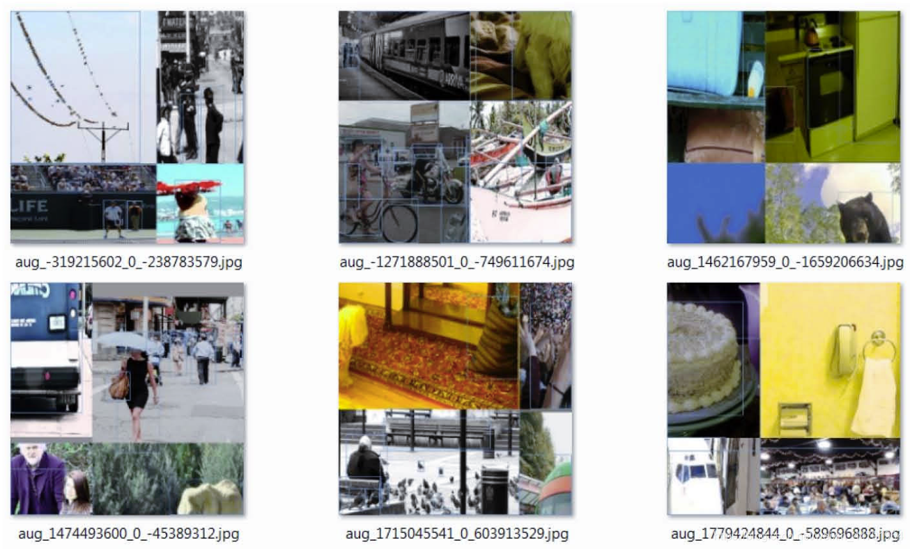


实现思路如下：
 1、每次读取四张图片。


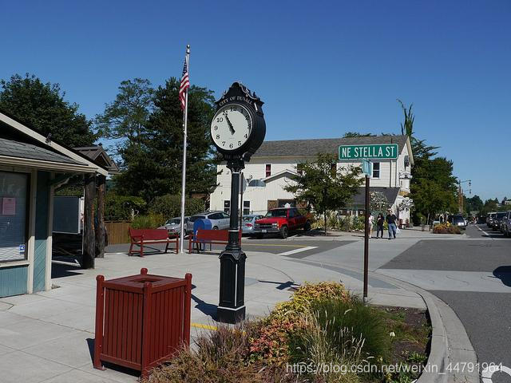


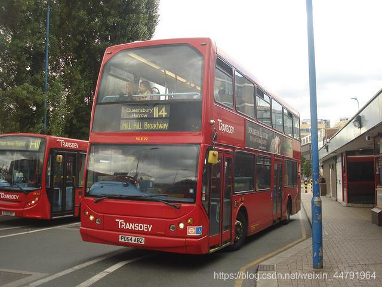


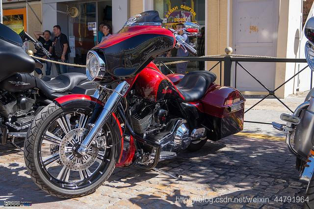


 2、分别对四张图片进行翻转、缩放、色域变化等，并且按照四个方向位置摆好。


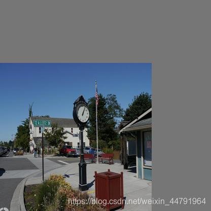


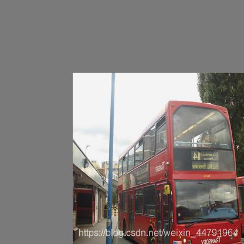


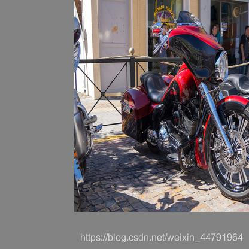


3、进行图片的组合和框的组合

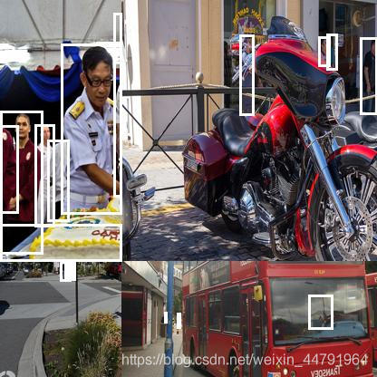

> utils/dataloader.py

```python
    """
    合并马赛克增强的框框
    """
    def merge_bboxes(self, bboxes, cutx, cuty):
        """
        bboxes
        cutx: 图像边缘,外边的框不要了
        cuty: 图像边缘,外边的框不要了
        """
        merge_bbox = []
        for i in range(len(bboxes)):
            for box in bboxes[i]:
                tmp_box = []
                x1, y1, x2, y2 = box[0], box[1], box[2], box[3]

                if i == 0:
                    if y1 > cuty or x1 > cutx:
                        continue
                    if y2 >= cuty and y1 <= cuty:
                        y2 = cuty
                    if x2 >= cutx and x1 <= cutx:
                        x2 = cutx

                if i == 1:
                    if y2 < cuty or x1 > cutx:
                        continue
                    if y2 >= cuty and y1 <= cuty:
                        y1 = cuty
                    if x2 >= cutx and x1 <= cutx:
                        x2 = cutx

                if i == 2:
                    if y2 < cuty or x2 < cutx:
                        continue
                    if y2 >= cuty and y1 <= cuty:
                        y1 = cuty
                    if x2 >= cutx and x1 <= cutx:
                        x1 = cutx

                if i == 3:
                    if y1 > cuty or x2 < cutx:
                        continue
                    if y2 >= cuty and y1 <= cuty:
                        y2 = cuty
                    if x2 >= cutx and x1 <= cutx:
                        x1 = cutx
                tmp_box.append(x1)
                tmp_box.append(y1)
                tmp_box.append(x2)
                tmp_box.append(y2)
                tmp_box.append(box[-1])
                merge_bbox.append(tmp_box)
        return merge_bbox

    """
    马赛克数据增强
    前面部分和 get_random_data 相同,后面才是Mosaic
    """
    def get_random_data_with_Mosaic(self, annotation_line, input_shape, max_boxes=100, hue=.1, sat=1.5, val=1.5):
        """
        annotation_line:
        input_shape: 模型输入大小,如 [416, 416]
        max_boxes: ?
        hue:    色调
        sat:    饱和度
        val:    明度
        """
        h, w = input_shape
        # 四张图片的分隔线
        min_offset_x = self.rand(0.25, 0.75)
        min_offset_y = self.rand(0.25, 0.75)

        nws     = [ int(w * self.rand(0.4, 1)), int(w * self.rand(0.4, 1)), int(w * self.rand(0.4, 1)), int(w * self.rand(0.4, 1))]
        nhs     = [ int(h * self.rand(0.4, 1)), int(h * self.rand(0.4, 1)), int(h * self.rand(0.4, 1)), int(h * self.rand(0.4, 1))]

        # 四张图片的放置位置
        place_x = [int(w*min_offset_x) - nws[0], int(w*min_offset_x) - nws[1], int(w*min_offset_x), int(w*min_offset_x)]
        place_y = [int(h*min_offset_y) - nhs[0], int(h*min_offset_y), int(h*min_offset_y), int(h*min_offset_y) - nhs[3]]

        image_datas = []
        box_datas   = []
        index       = 0
        for line in annotation_line:
            # 每一行进行分割
            line_content = line.split()
            # 打开图片
            image = Image.open(line_content[0])
            image = cvtColor(image)

            # 图片的大小
            iw, ih = image.size
            # 保存框的位置
            box = np.array([np.array(list(map(int,box.split(',')))) for box in line_content[1:]])

            # 是否翻转图片
            flip = self.rand()<.5
            if flip and len(box)>0:
                image = image.transpose(Image.FLIP_LEFT_RIGHT)
                box[:, [0,2]] = iw - box[:, [2,0]]

            nw = nws[index]
            nh = nhs[index]
            image = image.resize((nw,nh), Image.BICUBIC)

            # 将图片进行放置，分别对应四张分割图片的位置
            dx = place_x[index]
            dy = place_y[index]
            new_image = Image.new('RGB', (w,h), (128,128,128))
            new_image.paste(image, (dx, dy))
            image_data = np.array(new_image)

            index = index + 1
            box_data = []
            # 对box进行重新处理
            if len(box)>0:
                np.random.shuffle(box)
                box[:, [0,2]] = box[:, [0,2]]*nw/iw + dx
                box[:, [1,3]] = box[:, [1,3]]*nh/ih + dy
                box[:, 0:2][box[:, 0:2]<0] = 0
                box[:, 2][box[:, 2]>w] = w
                box[:, 3][box[:, 3]>h] = h
                box_w = box[:, 2] - box[:, 0]
                box_h = box[:, 3] - box[:, 1]
                box = box[np.logical_and(box_w>1, box_h>1)]
                box_data = np.zeros((len(box),5))
                box_data[:len(box)] = box

            image_datas.append(image_data)
            box_datas.append(box_data)

        # 将图片分割，放在一起
        cutx = int(w * min_offset_x)
        cuty = int(h * min_offset_y)

        # 放到新图片上
        new_image = np.zeros([h, w, 3])
        new_image[:cuty, :cutx, :] = image_datas[0][:cuty, :cutx, :]
        new_image[cuty:, :cutx, :] = image_datas[1][cuty:, :cutx, :]
        new_image[cuty:, cutx:, :] = image_datas[2][cuty:, cutx:, :]
        new_image[:cuty, cutx:, :] = image_datas[3][:cuty, cutx:, :]

        # 进行色域变换
        hue = self.rand(-hue, hue)
        sat = self.rand(1, sat) if self.rand()<.5 else 1/self.rand(1, sat)
        val = self.rand(1, val) if self.rand()<.5 else 1/self.rand(1, val)
        x = cv2.cvtColor(np.array(new_image/255,np.float32), cv2.COLOR_RGB2HSV)
        x[..., 0] += hue*360
        x[..., 0][x[..., 0]>1] -= 1
        x[..., 0][x[..., 0]<0] += 1
        x[..., 1] *= sat
        x[..., 2] *= val
        x[x[:, :, 0]>360, 0] = 360
        x[:, :, 1:][x[:, :, 1:]>1] = 1
        x[x<0] = 0
        new_image = cv2.cvtColor(x, cv2.COLOR_HSV2RGB)*255

        # 对框进行进一步的处理
        new_boxes = self.merge_bboxes(box_datas, cutx, cuty)

        return new_image, new_boxes
```

### b)、Label Smoothing平滑

标签平滑的思想很简单，具体公式如下：

```python
new_onehot_labels = onehot_labels * (1 - label_smoothing) + label_smoothing / num_classes
```

当label_smoothing的值为0.01得时候，公式变成如下所示：

```python
new_onehot_labels = y * (1 - 0.01) + 0.01 / num_classes
```

其实Label Smoothing平滑就是将标签进行一个平滑，原始的标签是0、1，在平滑后变成0.005(如果是二分类)、0.995，**也就是说对分类准确做了一点惩罚，让模型不可以分类的太准确，太准确容易过拟合。**

实现代码如下：

```python
#---------------------------------------------------#
#   平滑标签
#---------------------------------------------------#
def smooth_labels(y_true, label_smoothing,num_classes):
    return y_true * (1.0 - label_smoothing) + label_smoothing / num_classes
```

### c)、CIoU

IoU是比值的概念，对目标物体的scale是不敏感的。**然而常用的BBox的回归损失优化和IoU优化不是完全等价的，寻常的IoU无法直接优化没有重叠的部分。**

于是有人提出直接使用IOU作为回归优化loss，CIOU是其中非常优秀的一种想法。

CIOU将目标与anchor之间的距离，重叠率、尺度以及惩罚项都考虑进去，**使得目标框回归变得更加稳定，不会像IoU和GIoU一样出现训练过程中发散等问题。而惩罚因子把预测框长宽比拟合目标框的长宽比考虑进去。**

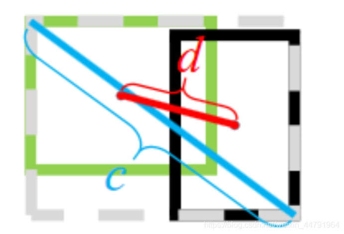


CoU公式如下
$$
CIoU = IoU − { \frac{ρ^2(b, b^{gt})} {c^2} } − αv
$$
> 前边还是IOU
>
> 其中， $ρ2(b, b^{g^t})$ 代表了预测框和真实框的中心点的欧式距离。 $c$ 代表的是能够同时包含预测框和真实框的最小闭包区域的对角线距离。
>
> 就是 **中心距离比上对角线距离**,那么中心距离近的话,值就接近0,CIOU就很大; 否则就会很大,CIOU就变小
>
> **αv 代表 长宽比**

> 而 α和 v 的公式如下
>
> v是 (arctan(真实框的宽高比) - arctan(预测框宽高比))^2

$$
v = {\frac 4 {π^2}} ( arctan \frac {w^{gt}} {h^{gt}} - arctan \frac w h )^2
$$

$$
α = \frac v {1 − IoU + v}
$$


> 如果直接把 CIoU 进行loss运算,那么它会越来越低,重合率就越来越小了,所以不合理
>
> 把 1-CIoU 就可以得到相应的LOSS了。
>
> 1-CIoU是偏移距离,让它越来越低

$$
LOSS_{CIoU} = 1 - IoU + \frac {ρ^2 (b, b^{gt})} {c^2} + αv
$$

> nets/yolo_training.py

```python
    """
    计算ciou
    """
    def box_ciou(self, b1, b2):
        """
        输入为:
        ----------
        b1: tensor, shape=(batch, feat_w, feat_h, anchor_num, 4), xywh  预测框
        b2: tensor, shape=(batch, feat_w, feat_h, anchor_num, 4), xywh  真实框

        返回为:
        -------
        ciou: tensor, shape=(batch, feat_w, feat_h, anchor_num, 1)
        """
        #----------------------------------------------------#
        #   求出预测框左上角右下角
        #----------------------------------------------------#
        b1_xy       = b1[..., :2]
        b1_wh       = b1[..., 2:4]
        b1_wh_half  = b1_wh/2.
        b1_mins     = b1_xy - b1_wh_half
        b1_maxes    = b1_xy + b1_wh_half
        #----------------------------------------------------#
        #   求出真实框左上角右下角
        #----------------------------------------------------#
        b2_xy       = b2[..., :2]
        b2_wh       = b2[..., 2:4]
        b2_wh_half  = b2_wh/2.
        b2_mins     = b2_xy - b2_wh_half
        b2_maxes    = b2_xy + b2_wh_half

        #----------------------------------------------------#
        #   求真实框和预测框所有的iou
        #----------------------------------------------------#
        intersect_mins  = torch.max(b1_mins, b2_mins)
        intersect_maxes = torch.min(b1_maxes, b2_maxes)
        intersect_wh    = torch.max(intersect_maxes - intersect_mins, torch.zeros_like(intersect_maxes))
        intersect_area  = intersect_wh[..., 0] * intersect_wh[..., 1]
        b1_area         = b1_wh[..., 0] * b1_wh[..., 1]
        b2_area         = b2_wh[..., 0] * b2_wh[..., 1]
        union_area      = b1_area + b2_area - intersect_area
        iou             = intersect_area / torch.clamp(union_area,min = 1e-6)

        #----------------------------------------------------#
        #   计算中心的差距
        #----------------------------------------------------#
        center_distance = torch.sum(torch.pow((b1_xy - b2_xy), 2), axis=-1)

        #----------------------------------------------------#
        #   找到包裹两个框的最小框的左上角和右下角
        #----------------------------------------------------#
        enclose_mins    = torch.min(b1_mins, b2_mins)
        enclose_maxes   = torch.max(b1_maxes, b2_maxes)
        enclose_wh      = torch.max(enclose_maxes - enclose_mins, torch.zeros_like(intersect_maxes))
        #----------------------------------------------------#
        #   计算对角线距离
        #----------------------------------------------------#
        enclose_diagonal = torch.sum(torch.pow(enclose_wh,2), axis=-1)

        #----------------------------------------------------#
        #   计算ciou,这里还不减去 αv,下面计算
        #   CIOU = IOU − { \frac{ρ^2(b, b^{g^t})} {c^2} } − αv
        #----------------------------------------------------#
        ciou            = iou - 1.0 * (center_distance) / torch.clamp(enclose_diagonal,min = 1e-6)

        #----------------------------------------------------#
        #   计算v和a
        #   v = {\frac 4 {π^2}} ( arctan \frac {w^{g^t}} {h^{g^t}} - arctan \frac w h )^2
        #   α = \frac v {1 − IOU + v}
        #----------------------------------------------------#
        v       = (4 / (math.pi ** 2)) * torch.pow((torch.atan(b1_wh[..., 0] / torch.clamp(b1_wh[..., 1],min = 1e-6)) - torch.atan(b2_wh[..., 0] / torch.clamp(b2_wh[..., 1], min = 1e-6))), 2)
        alpha   = v / torch.clamp((1.0 - iou + v), min=1e-6)
        # 最后减去αv
        ciou    = ciou - alpha * v
        return ciou
```

### d)、学习率余弦退火衰减

余弦退火衰减法，学习率会先上升再下降，这是退火优化法的思想。（关于什么是退火算法可以百度。）

上升的时候使用线性上升，下降的时候模拟cos函数下降。执行多次。

效果如图所示：


pytorch有直接实现的函数，可直接调用。

```python
# T_max 表示学习率到达最低的epoch是多少
lr_scheduler = optim.lr_scheduler.CosineAnnealingLR(optimizer, T_max=5, eta_min=1e-5)
```

## 2、loss组成

### a)、计算loss所需参数

> 在计算loss的时候，实际上是y_pre和y_true之间的对比：
>
> y_pre就是一幅**图像经过网络之后的输出，内部含有三个特征层的内容；其需要解码才能够在图上作画**
>
> y_true就是一个真实图像中，它的**每个真实框对应的(19,19)、(38,38)、(76,76)网格上的偏移位置、长宽与种类。其仍需要编码才能与y_pred的结构一致**
>
> 实际上y_pre和y_true内容的shape都是
>
>  (batch_size,19,19,3,85)
>  (batch_size,38,38,3,85)
>  (batch_size,76,76,3,85)

### b)、y_pre是什么

> 网络**最后输出的内容就是三个特征层每个网格点对应的预测框及其种类**，即三个特征层分别对应着图片被分为不同size的网格后，**每个网格点上三个先验框对应的位置、置信度及其种类。**
>
> 对于**输出的y1、y2、y3而言，[…, : 2]指的是相对于每个网格点的偏移量，[…, 2: 4]指的是宽和高，[…, 4: 5]指的是该框的置信度，[…, 5: ]指的是每个种类的预测概率。**
>  现在的y_pre还是没有解码的，解码了之后才是真实图像上的情况。

### c)、y_true是什么。

y_true就是一个真实图像中，它的**每个真实框对应的(19,19)、(38,38)、(76,76)网格上的偏移位置、长宽与种类。其仍需要编码才能与y_pred的结构一致**

### d)、loss的计算过程

在得到了y_pre和y_true后怎么对比呢？不是简单的减一下!

loss值需要对三个特征层进行处理，这里以最小的特征层为例。

**1、利用y_true取出该特征层中真实存在目标的点的位置(m,19,19,3,1)及其对应的种类(m,19,19,3,80)。**

**2、将prediction的预测值输出进行处理，得到reshape后的预测值y_pre，shape为(m,19,19,3,85)。还有解码后的xy，wh。**

**3、对于每一幅图，计算其中所有真实框与预测框的IOU，如果某些预测框和真实框的重合程度大于0.5，则忽略。**

**4、计算ciou作为回归的loss，这里只计算正样本的回归loss。**

**5、计算置信度的loss，其有两部分构成，第一部分是实际上存在目标的，预测结果中置信度的值与1对比；第二部分是实际上不存在目标的，在第四步中得到其最大IOU的值与0对比。**

**6、计算预测种类的loss，其计算的是实际上存在目标的，预测类与真实类的差距。**

其实际上计算的总的loss是三个loss的和，这三个loss分别是：

- 实际存在的框，**CIOU LOSS**。
- 实际存在的框，**预测结果中置信度的值与1对比；实际不存在的框，预测结果中置信度的值与0对比，该部分要去除被忽略的不包含目标的框**。
- 实际存在的框，**种类预测结果与实际结果的对比**。

> nets/yolo_training.py

```python
import torch
import torch.nn as nn
import math
import numpy as np

class YOLOLoss(nn.Module):
    def __init__(self, anchors, num_classes, input_shape, cuda, anchors_mask = [[6,7,8], [3,4,5], [0,1,2]], label_smoothing = 0):
        super(YOLOLoss, self).__init__()
        #-----------------------------------------------------------#
        #   13x13的特征层对应的anchor是[142, 110],[192, 243],[459, 401]
        #   26x26的特征层对应的anchor是[36, 75],[76, 55],[72, 146]
        #   52x52的特征层对应的anchor是[12, 16],[19, 36],[40, 28]
        #-----------------------------------------------------------#
        self.anchors        = anchors           # 先验框
        self.num_classes    = num_classes
        self.bbox_attrs     = 5 + num_classes   # 每个框的属性 4+1+num_classes
        self.input_shape    = input_shape       # 原始图像高宽
        self.anchors_mask   = anchors_mask      # [[6, 7, 8], [3, 4, 5], [0, 1, 2]]
        self.label_smoothing = label_smoothing

        self.ignore_threshold = 0.5
        self.cuda = cuda

    def clip_by_tensor(self, t, t_min, t_max):
        t = t.float()
        result = (t >= t_min).float() * t + (t < t_min).float() * t_min
        result = (result <= t_max).float() * result + (result > t_max).float() * t_max
        return result

    def MSELoss(self, pred, target):
        return torch.pow(pred - target, 2)

    def BCELoss(self, pred, target):
        epsilon = 1e-7
        pred    = self.clip_by_tensor(pred, epsilon, 1.0 - epsilon)
        output  = - target * torch.log(pred) - (1.0 - target) * torch.log(1.0 - pred)
        return output

    """
    计算ciou
    """
    def box_ciou(self, b1, b2):
        """
        输入为:
        ----------
        b1: tensor, shape=(batch, feat_w, feat_h, anchor_num, 4), xywh  预测框
        b2: tensor, shape=(batch, feat_w, feat_h, anchor_num, 4), xywh  真实框

        返回为:
        -------
        ciou: tensor, shape=(batch, feat_w, feat_h, anchor_num, 1)
        """
        #----------------------------------------------------#
        #   求出预测框左上角右下角
        #----------------------------------------------------#
        b1_xy       = b1[..., :2]
        b1_wh       = b1[..., 2:4]
        b1_wh_half  = b1_wh/2.
        b1_mins     = b1_xy - b1_wh_half
        b1_maxes    = b1_xy + b1_wh_half
        #----------------------------------------------------#
        #   求出真实框左上角右下角
        #----------------------------------------------------#
        b2_xy       = b2[..., :2]
        b2_wh       = b2[..., 2:4]
        b2_wh_half  = b2_wh/2.
        b2_mins     = b2_xy - b2_wh_half
        b2_maxes    = b2_xy + b2_wh_half

        #----------------------------------------------------#
        #   求真实框和预测框所有的iou
        #----------------------------------------------------#
        intersect_mins  = torch.max(b1_mins, b2_mins)
        intersect_maxes = torch.min(b1_maxes, b2_maxes)
        intersect_wh    = torch.max(intersect_maxes - intersect_mins, torch.zeros_like(intersect_maxes))
        intersect_area  = intersect_wh[..., 0] * intersect_wh[..., 1]
        b1_area         = b1_wh[..., 0] * b1_wh[..., 1]
        b2_area         = b2_wh[..., 0] * b2_wh[..., 1]
        union_area      = b1_area + b2_area - intersect_area
        iou             = intersect_area / torch.clamp(union_area,min = 1e-6)

        #----------------------------------------------------#
        #   计算中心的差距
        #----------------------------------------------------#
        center_distance = torch.sum(torch.pow((b1_xy - b2_xy), 2), axis=-1)

        #----------------------------------------------------#
        #   找到包裹两个框的最小框的左上角和右下角
        #----------------------------------------------------#
        enclose_mins    = torch.min(b1_mins, b2_mins)
        enclose_maxes   = torch.max(b1_maxes, b2_maxes)
        enclose_wh      = torch.max(enclose_maxes - enclose_mins, torch.zeros_like(intersect_maxes))
        #----------------------------------------------------#
        #   计算对角线距离
        #----------------------------------------------------#
        enclose_diagonal = torch.sum(torch.pow(enclose_wh,2), axis=-1)

        #----------------------------------------------------#
        #   计算ciou,这里还不减去 αv,下面计算
        #   CIOU = IOU − { \frac{ρ^2(b, b^{g^t})} {c^2} } − αv
        #----------------------------------------------------#
        ciou            = iou - 1.0 * (center_distance) / torch.clamp(enclose_diagonal,min = 1e-6)

        #----------------------------------------------------#
        #   计算v和a
        #   v = {\frac 4 {π^2}} ( arctan \frac {w^{g^t}} {h^{g^t}} - arctan \frac w h )^2
        #   α = \frac v {1 − IOU + v}
        #----------------------------------------------------#
        v       = (4 / (math.pi ** 2)) * torch.pow((torch.atan(b1_wh[..., 0] / torch.clamp(b1_wh[..., 1],min = 1e-6)) - torch.atan(b2_wh[..., 0] / torch.clamp(b2_wh[..., 1], min = 1e-6))), 2)
        alpha   = v / torch.clamp((1.0 - iou + v), min=1e-6)
        # 最后减去αv
        ciou    = ciou - alpha * v
        return ciou

    #---------------------------------------------------#
    #   平滑标签
    #---------------------------------------------------#
    def smooth_labels(self, y_true, label_smoothing, num_classes):
        return y_true * (1.0 - label_smoothing) + label_smoothing / num_classes

    def forward(self, l, input, targets=None):
        #----------------------------------------------------#
        #   l 代表使用的是第几个有效特征层 1 2 3
        #   input的shape为  bs, 3*(5+num_classes), 13, 13
        #                   bs, 3*(5+num_classes), 26, 26
        #                   bs, 3*(5+num_classes), 52, 52
        #   targets 真实框的标签情况 [batch_size, num_gt, 5]
        #----------------------------------------------------#
        #--------------------------------#
        #   获得图片数量，特征层的高和宽
        #--------------------------------#
        bs      = input.size(0)
        in_h    = input.size(2)
        in_w    = input.size(3)
        #-----------------------------------------------------------------------#
        #   计算步长
        #   每一个特征点对应原来的图片上多少个像素点
        #
        #   如果特征层为13x13的话，一个特征点就对应原来的图片上的32个像素点
        #   如果特征层为26x26的话，一个特征点就对应原来的图片上的16个像素点
        #   如果特征层为52x52的话，一个特征点就对应原来的图片上的8个像素点
        #   406 / 13 = 32
        #   stride_h = stride_w = 32、16、8
        #-----------------------------------------------------------------------#
        stride_h = self.input_shape[0] / in_h
        stride_w = self.input_shape[1] / in_w
        #-------------------------------------------------#
        #
        #   此时获得的scaled_anchors大小是相对于特征层的
        #-------------------------------------------------#
        scaled_anchors  = [(a_w / stride_w, a_h / stride_h) for a_w, a_h in self.anchors]
        #-----------------------------------------------#
        #   输入的input一共有三个，他们的shape分别是
        #   bs, 3 * (5+num_classes), 13, 13 => bs, 3, 5 + num_classes, 13, 13 => batch_size, 3, 13, 13, 5 + num_classes
        #
        #   batch_size, 3, 13, 13, 5 + num_classes
        #   batch_size, 3, 26, 26, 5 + num_classes
        #   batch_size, 3, 52, 52, 5 + num_classes
        #-----------------------------------------------#
        prediction = input.view(bs, len(self.anchors_mask[l]), self.bbox_attrs, in_h, in_w).permute(0, 1, 3, 4, 2).contiguous()

        #-----------------------------------------------#
        #   先验框的中心位置的调整参数
        #   sigmoid固定到0~1之间,每个框的中心点是按照分隔后的最近的左上角点,就是物体位置由网格左上角来负责预测
        #   调整到0~1之间就是坐标点的移动位置在右下角的方框内
        #-----------------------------------------------#
        x = torch.sigmoid(prediction[..., 0])
        y = torch.sigmoid(prediction[..., 1])
        #-----------------------------------------------#
        #   先验框的宽高调整参数
        #-----------------------------------------------#
        w = prediction[..., 2]
        h = prediction[..., 3]
        #-----------------------------------------------#
        #   获得置信度，是否有物体
        #-----------------------------------------------#
        conf = torch.sigmoid(prediction[..., 4])
        #-----------------------------------------------#
        #   种类置信度
        #   0~1之间,表示可能性
        #-----------------------------------------------#
        pred_cls = torch.sigmoid(prediction[..., 5:])

        #-----------------------------------------------#
        #   获得网络应该有的预测结果
        #-----------------------------------------------#
        y_true, noobj_mask, box_loss_scale = self.get_target(l, targets, scaled_anchors, in_h, in_w)

        #---------------------------------------------------------------#
        #   将预测结果进行解码，判断预测结果和真实值的重合程度
        #   如果重合程度过大则忽略，因为这些特征点属于预测比较准确的特征点
        #   作为负样本不合适
        #----------------------------------------------------------------#
        noobj_mask, pred_boxes = self.get_ignore(l, x, y, h, w, targets, scaled_anchors, in_h, in_w, noobj_mask)

        if self.cuda:
            y_true          = y_true.cuda()
            noobj_mask      = noobj_mask.cuda()
            box_loss_scale  = box_loss_scale.cuda()
        #-----------------------------------------------------------#
        #   reshape_y_true[...,2:3]和reshape_y_true[...,3:4]
        #   表示真实框的宽高，二者均在0-1之间
        #   2 - box_loss_scale 让真实框越大，比重越小，小框的比重更大。
        #-----------------------------------------------------------#
        box_loss_scale = 2 - box_loss_scale

        #---------------------------------------------------------------#
        #   计算预测结果和真实结果的CIOU
        #   loss = 1 - CIOU, 让这个值减小才能让CIOU变大
        #----------------------------------------------------------------#
        ciou        = (1 - self.box_ciou(pred_boxes[y_true[..., 4] == 1], y_true[..., :4][y_true[..., 4] == 1])) * box_loss_scale[y_true[..., 4] == 1]
        loss_loc    = torch.sum(ciou)
        #-----------------------------------------------------------#
        #   计算置信度的loss = 正样本loss(y_true) + 负样本loss(noobj_mask)
        #   计算了sigmoid,不能使用均方误差,要使用BCELoss
        #-----------------------------------------------------------#
        loss_conf   = torch.sum(self.BCELoss(conf, y_true[..., 4]) * y_true[..., 4]) + \
                      torch.sum(self.BCELoss(conf, y_true[..., 4]) * noobj_mask)
        #-----------------------------------------------------------#
        #   所有正样本分类损失,不使用交叉熵,用的是BCELoss   y_true[..., 4] == 1 包含物体才计算损失
        #-----------------------------------------------------------#
        loss_cls    = torch.sum(self.BCELoss(pred_cls[y_true[..., 4] == 1], self.smooth_labels(y_true[..., 5:][y_true[..., 4] == 1], self.label_smoothing, self.num_classes)))

        # loss总和
        loss        = loss_loc + loss_conf + loss_cls
        # 正样本数量
        num_pos = torch.sum(y_true[..., 4])
        num_pos = torch.max(num_pos, torch.ones_like(num_pos))
        return loss, num_pos

    def calculate_iou(self, _box_a, _box_b):
        #-----------------------------------------------------------#
        #   计算真实框的左上角和右下角
        #-----------------------------------------------------------#
        b1_x1, b1_x2 = _box_a[:, 0] - _box_a[:, 2] / 2, _box_a[:, 0] + _box_a[:, 2] / 2
        b1_y1, b1_y2 = _box_a[:, 1] - _box_a[:, 3] / 2, _box_a[:, 1] + _box_a[:, 3] / 2
        #-----------------------------------------------------------#
        #   计算先验框获得的预测框的左上角和右下角
        #-----------------------------------------------------------#
        b2_x1, b2_x2 = _box_b[:, 0] - _box_b[:, 2] / 2, _box_b[:, 0] + _box_b[:, 2] / 2
        b2_y1, b2_y2 = _box_b[:, 1] - _box_b[:, 3] / 2, _box_b[:, 1] + _box_b[:, 3] / 2

        #-----------------------------------------------------------#
        #   将真实框和预测框都转化成左上角右下角的形式
        #-----------------------------------------------------------#
        box_a = torch.zeros_like(_box_a)
        box_b = torch.zeros_like(_box_b)
        box_a[:, 0], box_a[:, 1], box_a[:, 2], box_a[:, 3] = b1_x1, b1_y1, b1_x2, b1_y2
        box_b[:, 0], box_b[:, 1], box_b[:, 2], box_b[:, 3] = b2_x1, b2_y1, b2_x2, b2_y2

        #-----------------------------------------------------------#
        #   A为真实框的数量，B为先验框的数量
        #-----------------------------------------------------------#
        A = box_a.size(0)
        B = box_b.size(0)

        #-----------------------------------------------------------#
        #   计算交的面积
        #-----------------------------------------------------------#
        max_xy  = torch.min(box_a[:, 2:].unsqueeze(1).expand(A, B, 2), box_b[:, 2:].unsqueeze(0).expand(A, B, 2))
        min_xy  = torch.max(box_a[:, :2].unsqueeze(1).expand(A, B, 2), box_b[:, :2].unsqueeze(0).expand(A, B, 2))
        inter   = torch.clamp((max_xy - min_xy), min=0)
        inter   = inter[:, :, 0] * inter[:, :, 1]
        #-----------------------------------------------------------#
        #   计算预测框和真实框各自的面积
        #-----------------------------------------------------------#
        area_a = ((box_a[:, 2]-box_a[:, 0]) * (box_a[:, 3]-box_a[:, 1])).unsqueeze(1).expand_as(inter)  # [A,B]
        area_b = ((box_b[:, 2]-box_b[:, 0]) * (box_b[:, 3]-box_b[:, 1])).unsqueeze(0).expand_as(inter)  # [A,B]
        #-----------------------------------------------------------#
        #   求IOU
        #-----------------------------------------------------------#
        union = area_a + area_b - inter
        return inter / union  # [A,B]

    """获得网络应该有的预测结果"""
    def get_target(self, l, targets, anchors, in_h, in_w):
        #-----------------------------------------------------#
        #   计算一共有多少张图片
        #-----------------------------------------------------#
        bs              = len(targets)
        #-----------------------------------------------------#
        #   用于选取哪些先验框不包含物体,默认指定都不包含物体
        #-----------------------------------------------------#
        noobj_mask      = torch.ones(bs, len(self.anchors_mask[l]), in_h, in_w, requires_grad = False)
        #-----------------------------------------------------#
        #   让网络更加去关注小目标
        #-----------------------------------------------------#
        box_loss_scale  = torch.zeros(bs, len(self.anchors_mask[l]), in_h, in_w, requires_grad = False)
        #-----------------------------------------------------#
        #   先验框应该有的真实结果
        #   batch_size, 3, 13, 13, 5 + num_classes
        #-----------------------------------------------------#
        y_true          = torch.zeros(bs, len(self.anchors_mask[l]), in_h, in_w, self.bbox_attrs, requires_grad = False)
        # 循环batch_size
        for b in range(bs):
            # 没目标就不计算
            if len(targets[b])==0:
                continue

            batch_target = torch.zeros_like(targets[b])
            #-------------------------------------------------------#
            #   计算出正样本在特征层上的中心点
            #-------------------------------------------------------#
            batch_target[:, [0,2]] = targets[b][:, [0,2]] * in_w
            batch_target[:, [1,3]] = targets[b][:, [1,3]] * in_h
            batch_target[:, 4] = targets[b][:, 4]
            batch_target = batch_target.cpu()

            #-------------------------------------------------------#
            #   将真实框转换一个形式
            #   [num_true_box, 4]
            #-------------------------------------------------------#
            gt_box          = torch.FloatTensor(torch.cat((torch.zeros((batch_target.size(0), 2)), batch_target[:, 2:4]), 1))
            #-------------------------------------------------------#
            #   将先验框转换一个形式
            #   [9, 4]
            #-------------------------------------------------------#
            anchor_shapes   = torch.FloatTensor(torch.cat((torch.zeros((len(anchors), 2)), torch.FloatTensor(anchors)), 1))
            #-------------------------------------------------------#
            #   计算IOU交并比
            #   self.calculate_iou(gt_box, anchor_shapes) = [num_true_box, 9]每一个真实框和9个先验框的重合情况
            #   best_ns: 二维
            #       [每个真实框最大的重合度max_iou, 每一个真实框最重合的先验框的序号]
            #   argmax返回下标,即先验框序号
            #-------------------------------------------------------#
            best_ns = torch.argmax(self.calculate_iou(gt_box, anchor_shapes), dim=-1)

            for t, best_n in enumerate(best_ns):

                # 判断当前先验框是否属于这一层
                if best_n not in self.anchors_mask[l]:
                    continue
                #----------------------------------------#
                #   判断这个先验框是当前特征点的哪一个先验框
                #----------------------------------------#
                k = self.anchors_mask[l].index(best_n)      # c通道
                #----------------------------------------#
                #   获得真实框属于哪个网格点
                #----------------------------------------#
                i = torch.floor(batch_target[t, 0]).long()  # w通道
                j = torch.floor(batch_target[t, 1]).long()  # h通道
                #----------------------------------------#
                #   取出真实框的种类
                #----------------------------------------#
                c = batch_target[t, 4].long()

                #----------------------------------------#
                #   noobj_mask代表无目标的特征点
                #----------------------------------------#
                noobj_mask[b, k, j, i] = 0                  # 有目标,将无目标设置为0
                #----------------------------------------#
                #   tx、ty代表中心调整参数的真实值
                #----------------------------------------#
                y_true[b, k, j, i, 0] = batch_target[t, 0]
                y_true[b, k, j, i, 1] = batch_target[t, 1]
                y_true[b, k, j, i, 2] = batch_target[t, 2]
                y_true[b, k, j, i, 3] = batch_target[t, 3]
                y_true[b, k, j, i, 4] = 1                   # 有包含物体,设置为1
                y_true[b, k, j, i, c + 5] = 1               # 先验框物体种类
                #----------------------------------------#
                #   用于获得xywh的比例
                #   大目标loss权重小，小目标loss权重大
                #   真实框宽高相乘,除以有效特征层宽高,归一化结果 小目标结果小,大目标结果大,
                #   后续计算 2 - box_loss_scale 让真实框越大，比重越小，小框的比重更大。
                #----------------------------------------#
                box_loss_scale[b, k, j, i] = batch_target[t, 2] * batch_target[t, 3] / in_w / in_h
        return y_true, noobj_mask, box_loss_scale

    """获得网络应该忽略的特征点,重合率高的忽略,重合率低的设为负样本"""
    def get_ignore(self, l, x, y, h, w, targets, scaled_anchors, in_h, in_w, noobj_mask):
        # 对预测结果进行解码,一直到for循环
        #-----------------------------------------------------#
        #   计算一共有多少张图片
        #-----------------------------------------------------#
        bs = len(targets)

        FloatTensor = torch.cuda.FloatTensor if x.is_cuda else torch.FloatTensor
        LongTensor  = torch.cuda.LongTensor if x.is_cuda else torch.LongTensor
        #-----------------------------------------------------#
        #   生成网格，先验框中心，网格左上角
        #-----------------------------------------------------#
        grid_x = torch.linspace(0, in_w - 1, in_w).repeat(in_h, 1).repeat(
            int(bs * len(self.anchors_mask[l])), 1, 1).view(x.shape).type(FloatTensor)
        grid_y = torch.linspace(0, in_h - 1, in_h).repeat(in_w, 1).t().repeat(
            int(bs * len(self.anchors_mask[l])), 1, 1).view(y.shape).type(FloatTensor)

        # 生成先验框的宽高
        scaled_anchors_l = np.array(scaled_anchors)[self.anchors_mask[l]]
        anchor_w = FloatTensor(scaled_anchors_l).index_select(1, LongTensor([0]))
        anchor_h = FloatTensor(scaled_anchors_l).index_select(1, LongTensor([1]))

        anchor_w = anchor_w.repeat(bs, 1).repeat(1, 1, in_h * in_w).view(w.shape)
        anchor_h = anchor_h.repeat(bs, 1).repeat(1, 1, in_h * in_w).view(h.shape)
        #-------------------------------------------------------#
        #   计算调整后的先验框中心与宽高
        #-------------------------------------------------------#
        pred_boxes_x    = torch.unsqueeze(x + grid_x, -1)
        pred_boxes_y    = torch.unsqueeze(y + grid_y, -1)
        pred_boxes_w    = torch.unsqueeze(torch.exp(w) * anchor_w, -1)
        pred_boxes_h    = torch.unsqueeze(torch.exp(h) * anchor_h, -1)
        pred_boxes      = torch.cat([pred_boxes_x, pred_boxes_y, pred_boxes_w, pred_boxes_h], dim = -1)

        # 循环batch_size,就是循环每一张图片
        for b in range(bs):
            #-------------------------------------------------------#
            #   将预测结果转换一个形式
            #   pred_boxes_for_ignore:     [num_anchors, 4]
            #-------------------------------------------------------#
            pred_boxes_for_ignore = pred_boxes[b].view(-1, 4)
            #-------------------------------------------------------#
            #   计算真实框，并把真实框转换成相对于特征层的大小
            #   gt_box:     [num_true_box, 4]
            #-------------------------------------------------------#
            if len(targets[b]) > 0:
                batch_target = torch.zeros_like(targets[b])
                #-------------------------------------------------------#
                #   计算出正样本在特征层上的中心点
                #   真实框进行缩放,调整为相对于当前特征层的大小
                #-------------------------------------------------------#
                batch_target[:, [0,2]] = targets[b][:, [0,2]] * in_w
                batch_target[:, [1,3]] = targets[b][:, [1,3]] * in_h
                batch_target = batch_target[:, :4]
                #-------------------------------------------------------#
                #   计算交并比
                #   anch_ious:      [num_true_box, num_anchors]
                #-------------------------------------------------------#
                anch_ious = self.calculate_iou(batch_target, pred_boxes_for_ignore)
                #-------------------------------------------------------#
                #   每个先验框对应真实框的最大重合度
                #   [anch_ious_max,  num_anchors]
                #-------------------------------------------------------#
                anch_ious_max, _    = torch.max(anch_ious, dim = 0)
                anch_ious_max       = anch_ious_max.view(pred_boxes[b].size()[:3])
                """如果重合率较高就要忽略"""
                noobj_mask[b][anch_ious_max > self.ignore_threshold] = 0
        return noobj_mask, pred_boxes

def weights_init(net, init_type='normal', init_gain = 0.02):
    def init_func(m):
        classname = m.__class__.__name__
        if hasattr(m, 'weight') and classname.find('Conv') != -1:
            if init_type == 'normal':
                torch.nn.init.normal_(m.weight.data, 0.0, init_gain)
            elif init_type == 'xavier':
                torch.nn.init.xavier_normal_(m.weight.data, gain=init_gain)
            elif init_type == 'kaiming':
                torch.nn.init.kaiming_normal_(m.weight.data, a=0, mode='fan_in')
            elif init_type == 'orthogonal':
                torch.nn.init.orthogonal_(m.weight.data, gain=init_gain)
            else:
                raise NotImplementedError('initialization method [%s] is not implemented' % init_type)
        elif classname.find('BatchNorm2d') != -1:
            torch.nn.init.normal_(m.weight.data, 1.0, 0.02)
            torch.nn.init.constant_(m.bias.data, 0.0)
    print('initialize network with %s type' % init_type)
    net.apply(init_func)
```

